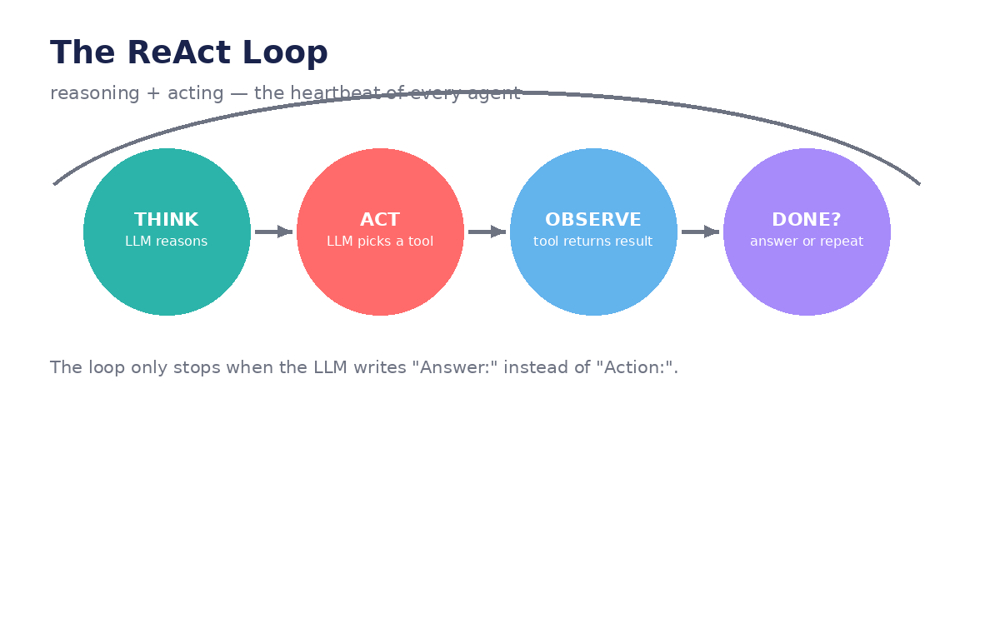

# Chapter 3 — ReAct Agent from Scratch

**Goal:** build a working agent with nothing but an LLM API and plain Python, and see
exactly which jobs belong to the model and which belong to your code.



## 1. ReAct = Reasoning + Acting

The loop has four beats:

1. **THINK** — the LLM reasons about what to do next (in text).
2. **ACT** — it names a tool and its input (still just text!).
3. **OBSERVE** — *your code* runs the tool and hands back the result.
4. **DONE?** — if the LLM writes `Answer:` instead of `Action:`, the loop ends.

The crucial insight: **the LLM never touches a tool.** It only *writes the name* of
the tool. Your code does the calling. This separation is what makes agents safe and
debuggable — the model proposes, the runtime disposes.

## 2. The two jobs

| The LLM's job (thinking in text) | The runtime's job (doing in code) |
|----------------------------------|-----------------------------------|
| Decide what to do next | Parse the reply: Action or Answer? |
| Write `Thought:`, `Action:`, `Pause` | Look up the tool by name, run it |
| Write `Answer:` when finished | Format the result as `Observation:` and loop |

In the demo this is `Agent.call()` / `Agent.execute()` (the LLM side) versus the
`query()` loop with its regex (the runtime side). The regex is the entire "brain"
of the runtime: *does this reply contain an Action, or an Answer?*

## 3. The system prompt teaches the format

The model doesn't know the Thought→Action→Pause→Observation format on its own.
The demo's system prompt teaches it with three things:

1. **The rules** — what each keyword means.
2. **The available actions** — the tool names it may use.
3. **A worked example** — a full trace it can imitate.

This is few-shot prompting doing real work: the example trace is the most important
part of the prompt. When your agent misbehaves, the example is the first place to look.

## 4. Tools are just functions in a dict

```python
tools = {"calculate": calculate, "average_dog_weight": average_dog_weight}
```

That's it. A tool is a Python function; the "tool registry" is a dictionary mapping
names to functions. The runtime looks up the name the LLM wrote and calls it. In
production these would be real connectors — but the mechanism is identical.

## In our demo

The demo's `OneClickAgent` doesn't literally run a ReAct loop, but it *is* a ReAct
agent at heart: the LLM decides (intent extraction, column mapping, metadata), and
Python code executes (SDK calls, INFORMATION_SCHEMA queries, pipeline creation).
The `max_turns` parameter in `query()` is also a pattern you'll reuse forever:
**always cap an agent's iterations** so a confused model can't loop forever.

## Try it

1. Add a third tool to the dict (e.g. a `weather` function with mocked data). What do
   you need to change in the system prompt for the LLM to use it?
2. Remove the worked example from the system prompt and run the agent. How does the
   output format degrade?
3. What happens if the LLM invents a tool name that isn't in the dict? The demo raises
   an exception — is that the right behavior, or should it ask the model to retry?

---
← [← Chapter 2](02-structured-output-and-intent.md) · [Next: LangGraph essentials →](04-langgraph-essentials.md)
