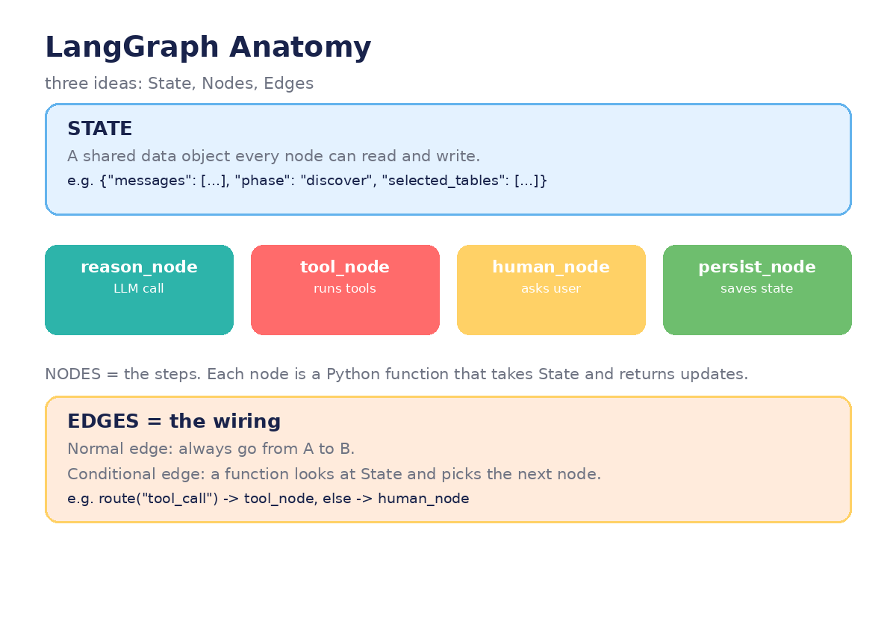

# Chapter 4 — LangGraph Essentials

**Goal:** understand LangGraph's three core ideas — State, Nodes, Edges — and rebuild
the ReAct loop from chapter 3 as a real graph.



## 1. Why a graph?

In chapter 3, the "loop" lived inside a Python `while` — the control flow was implicit
in your code. LangGraph makes it **explicit**: you declare the steps (nodes) and the
transitions (edges) as a graph, and the framework runs it. Explicit graphs are easier
to visualize, test, debug, and pause mid-run.

## 2. The three ideas

### State — the shared clipboard

```python
from typing import TypedDict, Annotated
from langgraph.graph import StateGraph, START, END

class AgentState(TypedDict):
    messages: Annotated[list, "append"]   # every node can add messages
    iterations: int                        # safety counter (our max_turns!)
```

State is a dict-like object that flows through the whole graph. Every node reads it
and returns *updates* to it. Compare this to the demo: `OneClickAgent.__init__` has
~20 attributes (`self.phase`, `self.selected_tables`, …) that serve as ad-hoc state.
LangGraph just gives that a name and a schema.

The `Annotated[list, "append"]` is a **reducer** — it says "when a node returns new
messages, *append* them instead of overwriting." This is exactly how the demo's
`self.history.append(...)` behaves, made declarative.

### Nodes — the steps

```python
def reason(state: AgentState):
    reply = LLM.invoke(state["messages"])
    return {"messages": [reply], "iterations": state["iterations"] + 1}

def act(state: AgentState):
    action = parse_action(state["messages"][-1].content)
    observation = TOOLS[action.name](action.input)
    return {"messages": [f"Observation: {observation}"]}
```

A node is a plain Python function: **state in, state-updates out.** No framework magic
inside — your existing code moves in unchanged.

### Edges — the wiring

```python
graph = StateGraph(AgentState)
graph.add_node("reason", reason)
graph.add_node("act", act)

graph.add_edge(START, "reason")
graph.add_conditional_edges("reason", route)   # Action? -> act · Answer? -> END
graph.add_edge("act", "reason")               # the loop!

agent = graph.compile()
```

- `add_edge("act", "reason")` **is** the ReAct loop — visible in one line.
- `add_conditional_edges` replaces the demo's regex `if/else`: a routing function
  looks at state and picks the next node.

## 3. Running it

```python
result = agent.invoke({"messages": ["How much does a toy poodle weigh?"], "iterations": 0})
```

`invoke()` runs the graph to completion; `stream()` yields each node's output as it
happens — perfect for showing the user "Thinking… Calling average_dog_weight…" live.

## In our demo

The demo's `PHASE_ORDER` list plus the giant `_step()` if/elif chain **is already a
graph**, drawn by hand: phases are nodes, `self.phase = X` assignments are edges,
and the `back` command is a backward edge. Chapter 7 converts it for real.

## Try it

1. Build the two-node ReAct graph above with a mocked tool. Run it with `stream()`
   and print each node's name as it executes.
2. Add a third node, `human_review`, between `reason` and `act` that prints the
   planned action and asks *you* to approve it. (This previews chapter 5.)
3. Replace the `iterations` counter with a conditional edge that routes to `END`
   after 5 turns. Which version is clearer — counter-in-state or edge logic?

---
← [← Chapter 3](03-react-agent-from-scratch.md) · [Next: Tools & human-in-the-loop →](05-tools-and-human-in-the-loop.md)
