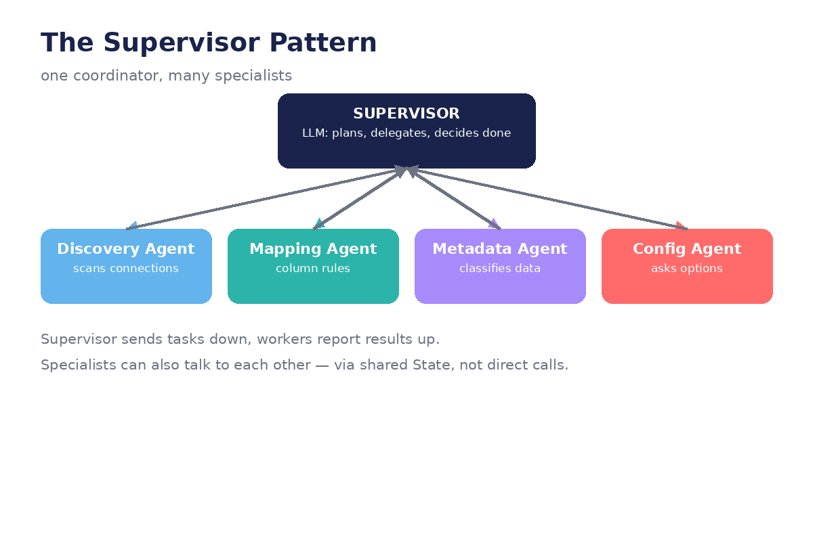

# Chapter 6 — Multi-Agent Systems

**Goal:** split one big agent into cooperating specialists, coordinated by a
supervisor, communicating through shared state.



## 1. Why more than one agent?

The demo's `AGENT_LABELS` registry already names the truth:

```python
"discover":       ("Source Discovery Agent", "Connection Scanning"),
"mapping":        ("Mapping Service", "ADH Column Mapping"),
"metadata":       ("Metadata Agent", "Business Metadata Generation"),
"configure":      ("Config Service", "Pipeline Configuration"),
```

One agent doing *everything* needs one giant prompt covering discovery, mapping,
metadata, and config — prompts get long, confused, and brittle. Specialists get
short, focused prompts and do one job well. The registry is also a UX feature:
`agent_banner()` announces *"🤖 [Metadata Agent] — Business Metadata Generation"*,
so the user sees a team working, not a black box.

## 2. The supervisor pattern

One coordinator LLM plans and delegates; specialists execute and report back:

```python
def supervisor(state):
    # LLM looks at state, decides: which specialist next, or done?
    return {"next": llm_decide(state)}

graph.add_conditional_edges("supervisor", lambda s: s["next"], {
    "discover": "discovery_agent",
    "mapping": "mapping_agent",
    "metadata": "metadata_agent",
    "done": END,
})
for worker in workers:
    graph.add_edge(worker, "supervisor")   # report back after each task
```

Every worker routes back to the supervisor, which re-plans. This is the same shape
as the course-intro's paper-writing team: planner, researcher, writer, reviewer —
each an LLM with a role-specific prompt.

## 3. How agents talk: shared state, not direct calls

Workers don't call each other. They read and write the shared `State`:

- Discovery writes `state["discovered_tables"]`
- Mapping reads those tables, writes `state["column_mappings"]`
- Metadata reads the mappings, writes `state["metadata_result"]` with classifications
- Config reads everything and asks its questions

This is why the demo's `_go_back()` invalidation rules matter: if you rewind to
`discover`, downstream state (tables, mappings, metadata) must be cleared, because
it was derived from the old discovery. In a graph, that rule becomes explicit:
a backward edge that also resets the derived fields.

## 4. The policy chain: metadata → policy → config → execution

The demo's most elegant multi-agent interaction needs no direct communication:

```
Metadata Agent classifies tables (PHI / PII / Financial)
        ↓  (reads state)
Policy step applies governance overrides (audit logging, masking, no previews)
        ↓  (writes state)
Config Service builds the pipeline with those overrides baked in
```

`_apply_classification_policy()` reads `metadata_result` from state and appends to
`policy_overrides` — the Metadata Agent never talks to the executor. **Indirect
coordination through state** is the core multi-agent skill: agents influence each
other by writing facts others read.

## In our demo

The demo simulates multi-agent with one class and a label registry. Your job in the
capstone is to make it real: one node per specialist, one supervisor routing between
them, all sharing state.

## Try it

1. Split your chapter-4 agent into two nodes with different system prompts: a
   *planner* (decides which tool) and an *executor* (formats the observation).
   Does the separation make failures easier to diagnose?
2. Add a *critic* node after `act` that reviews the observation and can send the
   graph back to `reason` with a note. (This is the Reflection pattern from the
   course intro.)
3. Design a policy rule of your own: "if classification is Financial, require human
   approval before execution." Where does that check live — supervisor, edge, or
   node?

---
← [← Chapter 5](05-tools-and-human-in-the-loop.md) · [Next: Capstone →](07-capstone-oneclick-in-langgraph.md)
