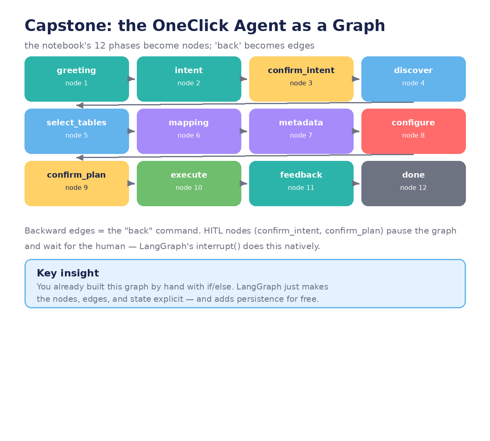

# Chapter 7 — Capstone: OneClick in LangGraph

**Goal:** rebuild the demo's 12-phase state machine as a real LangGraph application —
and understand exactly what the framework buys you.



## 1. You already built the graph

Look at the demo with fresh eyes:

| Demo mechanism | LangGraph equivalent |
|----------------|----------------------|
| `PHASE_ORDER` list | The graph's node topology |
| `self.phase = "mapping"` | An edge to the `mapping` node |
| `self.__init__` attributes | `AgentState` (typed, explicit) |
| `self.history.append(...)` | `Annotated[list, add_messages]` reducer |
| `chat()` → `_step()` router | `graph.invoke()` + conditional edges |
| `"back"` command | Backward edges + state invalidation |
| `"restart"` command | Fresh `invoke()` with empty state |
| `confirm_*` phases | `interrupt_before` pauses |
| `/tmp/oneclick_runs/...` JSON spec | Checkpointer-persisted state |

The demo works — but every one of these mechanisms is hand-rolled, implicit, and
untestable in isolation. LangGraph doesn't add capabilities; it makes the existing
ones **explicit**.

## 2. The state schema

```python
class OneClickState(TypedDict):
    messages: Annotated[list, add_messages]
    intent: dict | None
    connection: dict | None
    category: str | None
    discovered_tables: list
    selected_tables: list
    column_mappings: list
    metadata_result: list
    policy_overrides: list
    config_answers: Annotated[dict, "merge"]
    config_idx: int
    pipeline_name: str | None
```

Compare with `OneClickAgent.__init__` — same fields, but now typed, documented,
and visible to every node without `self.` plumbing.

## 3. Nodes, one per phase

Each `_step()` branch becomes a node function. Example — the discovery node keeps
the honesty guarantee front and center:

```python
def discover(state: OneClickState):
    conns = [c for c in w.connections.list() ...]   # real, via SDK
    meta = query_information_schema(state["connection"]["name"])  # real, via federation
    # NO llm-generated tables — the rule from the demo becomes a code comment AND a test
    return {"discovered_tables": [t["table"] for t in meta["tables"]]}
```

And the policy node is pure state transformation — trivially unit-testable:

```python
def apply_policy(state: OneClickState):
    overrides = []
    if any(m["classification"] == "PHI" for m in state["metadata_result"]):
        overrides += [PHI_AUDIT_LOGGING, PHI_NO_PREVIEW, PHI_INTERNAL_LLM]
    return {"policy_overrides": overrides}
```

## 4. Edges: forward, backward, and human

```python
graph.add_edge("greeting", "intent")
graph.add_conditional_edges("intent", route_intent_confirmed,
                            {"confirmed": "discover", "denied": "intent"})
graph.add_edge("discover", "select_tables")
# ... the happy path is just the PHASE_ORDER list, drawn as edges

graph.add_conditional_edges("configure", route_back_or_next,
                            {"back": "configure", "next": "confirm_plan"})
graph = graph.compile(
    checkpointer=MemorySaver(),          # persistence: resume any run
    interrupt_before=["execute_pipeline"] # the confirm_plan gate, natively
)
```

The checkpointer is the biggest free win: every state transition is saved, so a
crashed or interrupted run resumes exactly where it stopped — no more lost wizard
progress. Time-travel debugging (re-run from any checkpoint with edited state)
falls out of the same mechanism.

## 5. What to build

Your capstone, in order:

1. **State + 3 nodes** — `greeting → intent → confirm_intent`, with the JSON
   extractor from chapter 2. Get the loop talking.
2. **Discovery** — real `w.connections.list()` + `remote_query` INFORMATION_SCHEMA.
   Write a test asserting no table name ever comes from the LLM.
3. **Specialists** — mapping and metadata as separate nodes with focused prompts;
   add the supervisor from chapter 6 if you're ambitious.
4. **Policy + config** — the classification→policy→config chain, then the config
   wizard with working `back`.
5. **Interrupts + execution** — `interrupt_before=["execute_pipeline"]`, duplicate-name
   check, real `w.pipelines.create()`. (Test against a dev workspace!)

## 6. What you learned — the whole arc

- **Ch 1:** talk to models and the workspace.
- **Ch 2:** turn prose into data you can act on.
- **Ch 3:** the agent loop, and who does what (LLM proposes, code disposes).
- **Ch 4:** make the loop an explicit graph.
- **Ch 5:** real tools, and pausing for humans before irreversible steps.
- **Ch 6:** split the work across specialists coordinated through state.
- **Ch 7:** the demo you started with, rebuilt properly.

The deepest lesson: **the demo was already a LangGraph app** — it just didn't know
it yet. Frameworks don't invent your design; they give your design a shape that
other engineers can read, test, and trust.

---
← [← Chapter 6](06-multi-agent-systems.md) · [Course home](README.md)

*Built from the OneClick Ingestion Agent notebook · September 2026*
