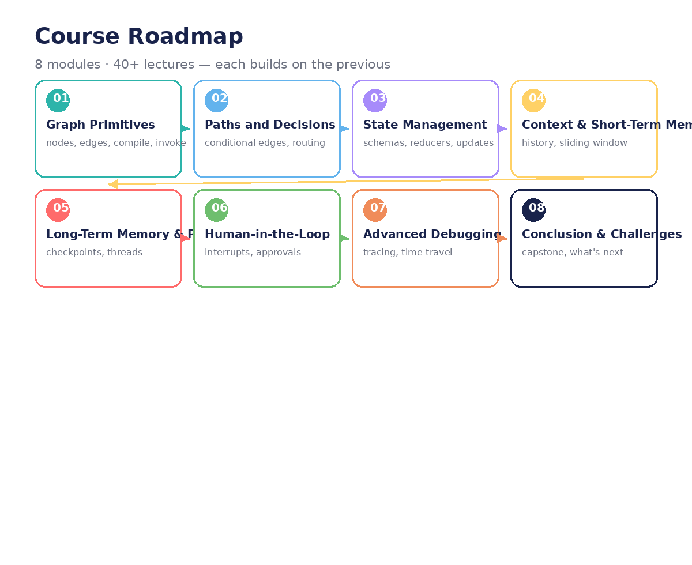

# LangGraph: From Primitives to Production
### An 8-module course for new engineers — ending with a real multi-agent demo

**8 modules · 40+ lectures · each module builds on the previous one.**
Includes demos, visuals, and labs throughout.

You'll learn LangGraph the way it was meant to be learned: by rebuilding a real
system. Our running example is the **OneClick Ingestion Agent** — a conversational
wizard that turns *"Ingest SAP ECC sales data"* into a real, governed Databricks
pipeline (live connection discovery, real table discovery via Lakehouse Federation,
LLM-assisted mapping and classification, human approval gates, pipeline creation).

## The 8 modules

| # | Module | Core question it answers |
|---|--------|--------------------------|
| 01 | [Graph Primitives](module-01-graph-primitives.md) | What is a graph? (nodes, edges, compile, invoke) |
| 02 | [Paths and Decisions](module-02-paths-and-decisions.md) | How does a graph decide where to go next? |
| 03 | [State Management](module-03-state-management.md) | How do nodes share data without chaos? |
| 04 | [Context and Short-Term Memory](module-04-context-and-short-term-memory.md) | How does the agent remember the conversation? |
| 05 | [Long-Term Memory and Persistence](module-05-long-term-memory-and-persistence.md) | How does work survive a crash or a coffee break? |
| 06 | [Human-in-the-Loop](module-06-human-in-the-loop.md) | Where do humans approve, edit, or stop the agent? |
| 07 | [Advanced Debugging](module-07-advanced-debugging.md) | How do you find out why the agent did that? |
| 08 | [Conclusion and Challenges](module-08-conclusion-and-challenges.md) | Capstone: the full OneClick agent as a graph |

## How each module works

Every module has **5 lectures**. Each lecture follows the same shape:

1. **Concept** — the idea in plain language, with a visual.
2. **In the demo** — where it appears in the OneClick notebook code.
3. **Lab** — a hands-on exercise to make it stick.

## Prerequisites

- Python basics (functions, dicts, classes).
- A Databricks workspace for the demo chapters (uses `langchain-databricks` + the Databricks SDK).
- No LangChain/LangGraph experience needed.

## The arc

Modules 1–3 give you the machinery (graphs, routing, state). Modules 4–5 give the
agent memory (short-term, then long-term). Module 6 adds the human. Module 7 teaches
you to debug it all. Module 8 puts it together: the 12-phase OneClick wizard,
rebuilt as a production LangGraph application.
