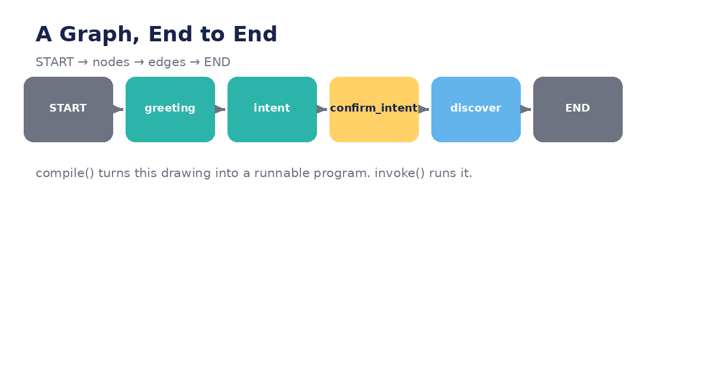

# Module 01 — Graph Primitives

*What is a graph? Nodes, edges, compiling, invoking, streaming — with a complete
working example you can run.*



---

## Lecture 1.1 — Thinking in graphs

An agent is a **loop with decisions**: think, act, observe, repeat. A graph makes
that loop *visible*. Instead of control flow hidden inside `while` loops and
`if/elif` chains, you declare:

- **Nodes** — the steps (each a Python function).
- **Edges** — the transitions between steps.

The OneClick demo's `PHASE_ORDER` list (`greeting → intent → discover → …`) is
already a graph — drawn by hand. This module gives you the real vocabulary for it.

**Example — the demo's hand-drawn graph:**

```python
PHASE_ORDER = ["greeting", "intent", "confirm_intent", "discover",
               "select_tables", "mapping", "metadata", "configure",
               "confirm_plan", "execute", "feedback", "done"]
# ...and deep inside _step():
if self.phase == "greeting":
    self.phase = "intent"          # <- an edge, hidden in an if-branch
```

Every `self.phase = X` is an edge. Every branch is a node. LangGraph just asks you
to say so up front.

**Lab:** Draw the demo's 12 phases on paper as boxes and arrows. Circle every place
where the code says `self.phase = X` — each circle is an edge you drew by hand.

## Lecture 1.2 — Nodes: state in, updates out

```python
from typing import TypedDict

class AgentState(TypedDict):
    messages: list
    user_name: str | None

def greeting(state: AgentState) -> dict:
    """First node: say hello, ask what to ingest."""
    return {"messages": ["👋 Hi! What data should we ingest today?"]}

def remember_name(state: AgentState) -> dict:
    """Second node: pull a name out of the reply (toy version)."""
    last = state["messages"][-1]
    name = last.split("my name is")[-1].strip() if "my name is" in last else None
    return {"user_name": name}
```

Three rules every node follows:

1. **Takes the whole state, reads what it needs** (`state["messages"]`).
2. **Returns only what changed** (`{"user_name": name}`) — never the full state.
3. **No framework magic inside** — plain Python, which means plain unit tests.

**In the demo:** `_show_filtered_connections()` reads `self.intent`, returns
nothing, but *prints* — a side effect. As a node it would *return*
`{"filtered_connections": [...]}` and let a separate display step print. Keeping
I/O out of nodes is what makes them testable.

**Lab:** Rewrite the demo's `_extract_intent()` as a node: input state with
`messages`, output `{"intent": {...}}`. Write a test with a canned message —
no LLM needed if you stub the extraction.

## Lecture 1.3 — Edges: the wiring

```python
from langgraph.graph import StateGraph, START, END

graph = StateGraph(AgentState)
graph.add_node("greeting", greeting)
graph.add_node("remember_name", remember_name)

graph.add_edge(START, "greeting")          # execution begins here
graph.add_edge("greeting", "remember_name")
graph.add_edge("remember_name", END)       # ...and ends here
```

`START` is a virtual entry point; `END` terminates the run. A normal edge means
"always go from A to B" — no conditions, no surprises. Read the four `add_edge`
lines and you can *see* the program's shape without reading any node code.

**Example — what this replaces in the demo:**

```python
# demo (implicit):
def _step(self):
    if self.phase == "greeting":
        ...
        self.phase = "intent"     # edge hidden inside logic

# graph (explicit):
graph.add_edge("greeting", "intent")
```

**Lab:** Build the 3-node graph above with the stub functions from 1.2. Before
running it, show the edge list to someone and ask them to describe what the
program does. That's the readability win.

## Lecture 1.4 — Compile and invoke: a complete runnable example

```python
from typing import TypedDict
from langgraph.graph import StateGraph, START, END

class AgentState(TypedDict):
    messages: list
    intent: dict | None

def greeting(state: AgentState):
    return {"messages": ["👋 Hi! I'm the OneClick assistant. What should we ingest?"]}

def extract_intent(state: AgentState):
    user_msg = state["messages"][-1]
    # toy extractor — Module 2 replaces this with the real LLM version
    return {"intent": {"source_system": user_msg, "source_type": "unknown"}}

graph = StateGraph(AgentState)
graph.add_node("greeting", greeting)
graph.add_node("extract_intent", extract_intent)
graph.add_edge(START, "greeting")
graph.add_edge("greeting", "extract_intent")
graph.add_edge("extract_intent", END)

agent = graph.compile()   # declaration → runnable program

# First invoke: the graph runs greeting, then stops (no user reply yet)
state = agent.invoke({"messages": [], "intent": None})
print(state["messages"])  # ['👋 Hi! ...']

# Second invoke: feed the user's reply back in
state = agent.invoke({"messages": state["messages"] + ["SAP ECC sales"],
                      "intent": None})
print(state["intent"])    # {'source_system': 'SAP ECC sales', 'source_type': 'unknown'}
```

`compile()` freezes your declaration into an executable. `invoke()` takes the
**initial state** and runs to `END`, returning the final state. Notice the
two-invoke dance: graphs don't wait for users by themselves — *you* drive the
turns, which is exactly what Module 06 (human-in-the-loop) formalizes.

**In the demo:** `OneClickAgent()` is compile; the first `chat("hello")` is invoke.

**Lab:** Change `extract_intent` to detect the word "salesforce" and set
`source_type` to `"saas"`. Invoke with "Sync Salesforce contacts" and verify.

## Lecture 1.5 — Streaming: watch it think

```python
for step in agent.stream({"messages": [], "intent": None}):
    node_name = list(step.keys())[0]
    print(f"--- node: {node_name} ---")
    print(step[node_name])
```

Output:

```
--- node: greeting ---
{'messages': ["👋 Hi! I'm the OneClick assistant. What should we ingest?"]}
--- node: extract_intent ---
{'intent': {'source_system': '...', 'source_type': 'unknown'}}
```

`stream()` yields one entry **per node execution** — the difference between a
black box and a glass box. Production uses:

- `stream_mode="updates"` — just the state updates (shown above).
- `stream_mode="messages"` — LLM tokens as they're generated (for typing effects).
- `stream_mode="values"` — the full state after each node.

**In the demo:** the `agent_banner("discover")` announcements ("🔍 *Source
Discovery Agent* — scanning connections…") are hand-rolled streaming. With a
real graph, the UI subscribes to the stream and renders each node's progress.

**Lab:** Stream your graph with `stream_mode="values"` and print the full state
after each node. Then write a tiny "banner" function that prints
`▶ running {node_name}…` per step — you've rebuilt `agent_banner()`.

---
← [Course home](README.md) · [Next: Module 02 →](module-02-paths-and-decisions.md)
