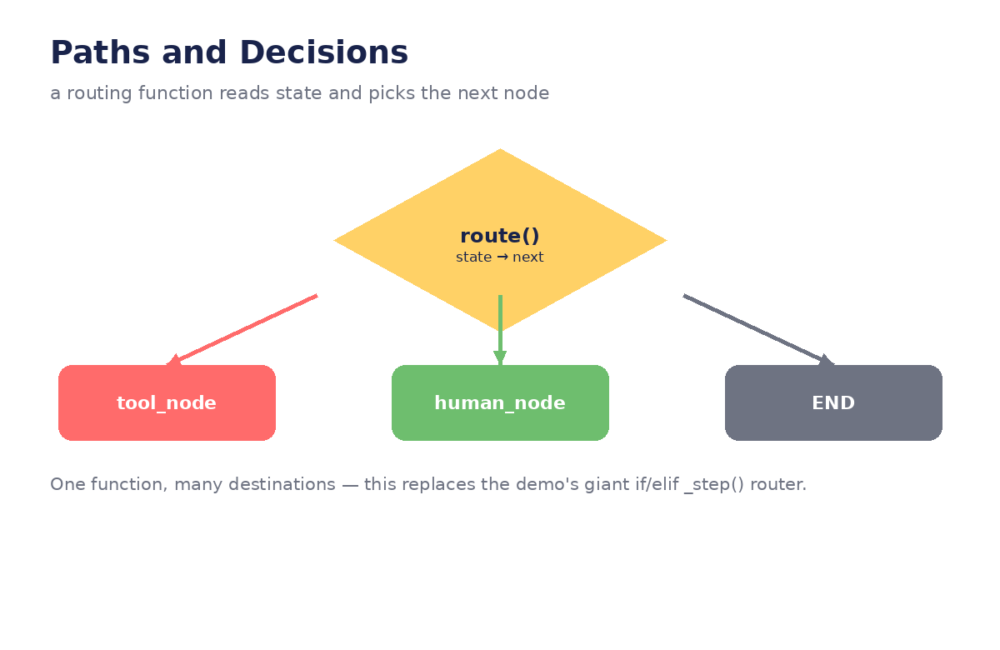
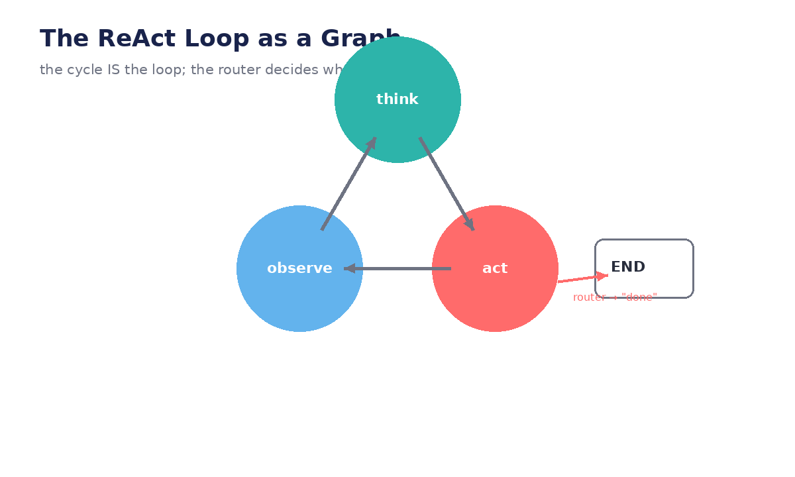

# Module 02 — Paths and Decisions

*How a graph decides where to go next: conditional edges, routing functions, loops —
with a complete ReAct agent you can run.*




---

## Lecture 2.1 — Conditional edges: your first branch

A normal edge always goes A → B. A **conditional edge** asks a function first:

```python
def route_after_confirm(state: AgentState) -> str:
    """Read state, return the NAME of the next node."""
    if state.get("intent_confirmed"):
        return "discover"
    if state.get("user_correction"):
        return "extract_intent"   # try again with the correction
    return "confirm_intent"       # ask again

graph.add_conditional_edges("confirm_intent", route_after_confirm)
```

The contract is tiny: **state in, node-name out**. LangGraph calls your function,
takes the returned string, and jumps to that node. This one mechanism replaces
the demo's entire `_step()` if/elif router.

**Example — the demo's confirm branch, decoded:**

```python
# demo's _step(), condensed:
if self.phase == "confirm_intent":
    if answer == "yes":      self.phase = "discover"      # edge → discover
    elif answer == "correct": self.phase = "intent"       # edge → intent
    else:                    self.phase = "confirm_intent" # edge → self

# graph version: exactly the route_after_confirm() above
```

**Lab:** Add a conditional edge to your Module 01 graph: if the last message
contains "?", route to a `clarify` node; otherwise route to `extract_intent`.
Test both paths.

## Lecture 2.2 — The ReAct loop as edges (full code)

The agent heartbeat — think → act → observe → repeat — expressed as a graph:

```python
from typing import TypedDict
from langgraph.graph import StateGraph, START, END

class ReActState(TypedDict):
    messages: list
    iterations: int

TOOLS = {
    "average_dog_weight": lambda breed: f"A {breed} weighs ~6.5kg.",
}

def think(state: ReActState):
    """LLM decides: call a tool, or answer. (Stubbed here; real LLM in the lab.)"""
    last = state["messages"][-1]
    if "poodle" in last.lower() and state["iterations"] == 0:
        reply = "Action: average_dog_weight, Input: toy poodle"
    else:
        reply = "Answer: A toy poodle weighs about 6.5kg."
    return {"messages": state["messages"] + [reply],
            "iterations": state["iterations"] + 1}

def act(state: ReActState):
    """Runtime parses the Action and runs the tool."""
    reply = state["messages"][-1]                      # "Action: average_dog_weight, Input: toy poodle"
    _, rest = reply.split("Action:", 1)
    tool_name, tool_input = [p.strip() for p in rest.split(", Input:", 1)]
    result = TOOLS[tool_name](tool_input)              # the LLM never touches the tool
    return {"messages": state["messages"] + [f"Observation: {result}"]}

def route_after_think(state: ReActState) -> str:
    last = state["messages"][-1]
    if last.startswith("Action:"):
        return "act"
    return END

graph = StateGraph(ReActState)
graph.add_node("think", think)
graph.add_node("act", act)
graph.add_edge(START, "think")
graph.add_conditional_edges("think", route_after_think)  # Action? → act · Answer? → END
graph.add_edge("act", "think")                           # ← the loop, in one line

agent = graph.compile()
final = agent.invoke({"messages": ["How much does a toy poodle weigh?"], "iterations": 0})
print(final["messages"][-1])
# Answer: A toy poodle weighs about 6.5kg.
```

Study the shape: `think → act → think → …` cycles until the router sees
`Answer:` and returns `END`. **The cycle in the graph IS the loop** — no `while`
statement anywhere.

**Lab:** Replace the stubbed `think` with a real `LLM.invoke()` call using the
ReAct system prompt from your notes. Run it against the real tool. What breaks
first — the parsing or the reasoning?

## Lecture 2.3 — Routing tables: one node, many destinations

When a supervisor fans out to specialists, map names explicitly:

```python
def supervisor_route(state: OneClickState) -> str:
    return state["next"]   # the supervisor LLM writes "discover", "mapping", ...

graph.add_conditional_edges("supervisor", supervisor_route, {
    "discover": "discovery_agent",
    "mapping":  "mapping_agent",
    "metadata": "metadata_agent",
    "configure": "config_agent",
    "done": END,
})
```

The dict is a **routing table**: keys are what the router returns, values are
destination nodes. It's readable, reviewable in a PR, and adding a specialist
means adding one line — compare the demo's `AGENT_LABELS` registry, which names
responsibilities but can't execute them.

**Example — adding a specialist:**

```python
# 1. write the node
def quality_agent(state): ...

# 2. register it
graph.add_node("quality_agent", quality_agent)

# 3. add one line to the routing table
"quality": "quality_agent",
```

**Lab:** Add a `quality_agent` entry to the routing table. What happens if the
supervisor returns `"quality"` but you forgot step 2? (Try it — the error message
is instructive.)

## Lecture 2.4 — Bounding loops: the max-turns pattern

Graphs cycle forever if the router never says stop. Carry a counter in state:

```python
MAX_TURNS = 5

def route_after_think(state: ReActState) -> str:
    if state["iterations"] >= MAX_TURNS:
        return "give_up"          # a node that says "I couldn't do it"
    if state["messages"][-1].startswith("Action:"):
        return "act"
    return END

graph.add_node("give_up", lambda s: {"messages": s["messages"] + ["Answer: I got stuck — here's what I tried."]})
```

Two lessons:

1. **The bound lives in the router, the counter in state** — both visible, both testable.
2. **"Give up" is a node, not an exception.** A graceful final message beats a traceback; the demo's `query(max_turns=...)` does the same.

**Example — what happens without the bound:** point the stubbed `think` at an
input it can never answer ("Action: …" forever) and watch `iterations` climb.
Now you know why every production agent has this.

**Lab:** Set `MAX_TURNS = 2` and ask a question needing 3 tool calls. Read the
`give_up` message — is it useful? Improve it to summarize what was tried.

## Lecture 2.5 — Mapping the demo's router (worked exercise)

Take the demo's `_step()` and decode it into edges. Here's the method applied to
three branches — do the rest as your lab:

| `_step()` branch | Node | Reads | Returns | Outgoing edges |
|---|---|---|---|---|
| `greeting` | `greeting` | — | greeting text | → `intent` (normal edge) |
| `intent` | `extract_intent` | last message | `intent` dict | → `confirm_intent` (normal edge) |
| `confirm_intent` | `confirm_intent` | user reply | confirmed? | → `discover` / → `intent` / → `confirm_intent` (conditional) |
| `discover` | `discover` | intent | connections, tables | → `select_tables` (normal edge) |

**The pattern you'll notice:** "collect input" branches are normal edges;
"did the human accept it?" branches are conditional edges. That sentence is
worth memorizing — it tells you where every router in your capstone goes.

**Lab:** Finish the table for `select_tables`, `mapping`, `metadata`,
`configure`, `confirm_plan`, `execute`. Mark each edge normal vs conditional.
This table *is* your Module 08 blueprint.

---
← [← Module 01](module-01-graph-primitives.md) · [Next: Module 03 →](module-03-state-management.md)
