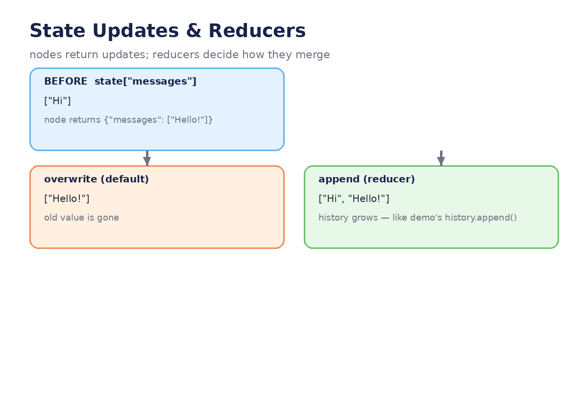
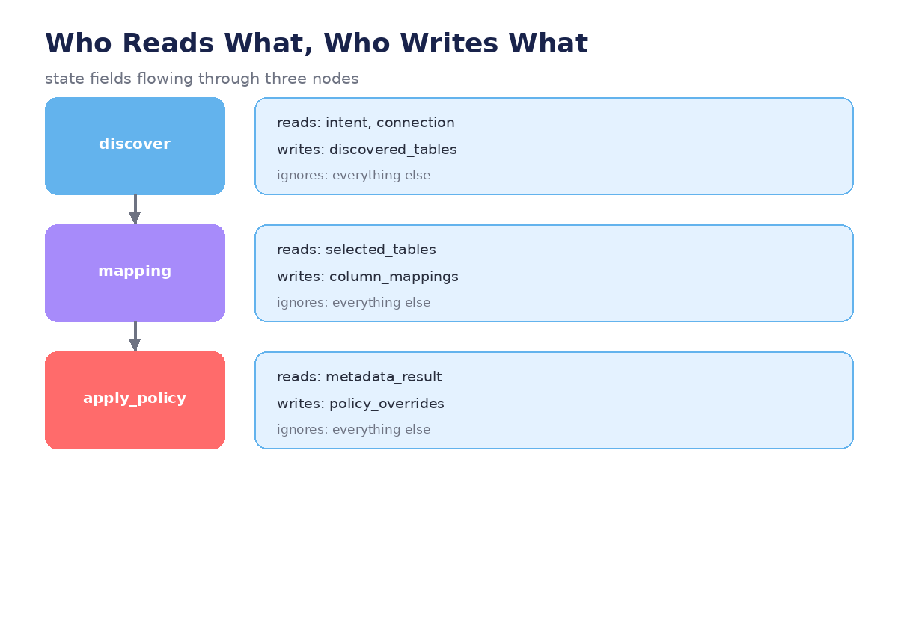

# Module 03 — State Management

*How nodes share data without chaos: schemas, reducers, invalidation — with the
full OneClickState worked out.*




---

## Lecture 3.1 — From 20 attributes to one schema

The demo's `__init__` scatters state across ~20 attributes. Here's the same
information as one declared schema:

```python
from typing import TypedDict, Annotated
from langgraph.graph import add_messages

class OneClickState(TypedDict):
    # conversation
    messages: Annotated[list, add_messages]
    # intent & source
    intent: dict | None
    intent_confirmed: bool
    connection: dict | None
    # discovery & selection
    discovered_tables: list
    selected_tables: list
    # mapping & metadata
    column_mappings: list
    metadata_result: list
    policy_overrides: list
    # config wizard
    config_questions: list
    config_answers: Annotated[dict, "merge"]
    config_idx: int
    # execution
    pipeline_name: str | None
    run_spec: dict | None
```

Why this beats attributes:

- **Typed** — a wrong shape fails loudly instead of surfacing three phases later.
- **Visible** — one glance shows everything the agent knows.
- **Shared** — every node receives the same object; no `self.` plumbing.

**Lab:** Find three `__init__` attributes in the demo that are *display* state
(e.g. cached banners) rather than *decision* state. They don't belong in the
schema — where should they live instead? (Answer: the UI layer.)

## Lecture 3.2 — Reducers: how updates merge (worked example)

Default behavior: a node's return **overwrites** the field. Reducers change the
merge strategy per field:

```python
class AgentState(TypedDict):
    messages: Annotated[list, add_messages]  # append each node's messages
    config_answers: Annotated[dict, "merge"] # merge new keys into the dict
    selected_tables: list                    # plain overwrite
```

**Trace it through:**

```python
# state: {"messages": ["Hi"], "config_answers": {"a": 1}, "selected_tables": ["T1"]}

node returns {"messages": ["Hello!"], "config_answers": {"b": 2}, "selected_tables": ["T2"]}

# result:
#   messages:       ["Hi", "Hello!"]          ← appended
#   config_answers: {"a": 1, "b": 2}          ← merged
#   selected_tables: ["T2"]                   ← overwritten
```

`add_messages` is the demo's `self.history.append(...)` made declarative; the
dict merge is how the config wizard accumulates answers without wiping earlier
ones. **Rule of thumb:** if a field is *history*, append; if it's *a form being
filled*, merge; if it's *the current choice*, overwrite.

**Lab:** Add a `warnings: Annotated[list, "append"]` field. Have three nodes each
append one warning. Stream the run and watch the list grow.

## Lecture 3.3 — Nodes only see what they need (with tests)

A node receives the whole state but should touch only its inputs. The demo's
policy function is the perfect specimen — lift it almost unchanged:

```python
PHI_OVERRIDES = ["audit_logging", "no_data_preview", "internal_llm_only"]
PII_OVERRIDES = ["column_masking", "audit_logging"]

def apply_policy(state: OneClickState) -> dict:
    """Reads: metadata_result · Writes: policy_overrides · Ignores: rest."""
    overrides = []
    for m in state["metadata_result"]:
        if m["classification"] == "PHI":
            overrides += [o for o in PHI_OVERRIDES if o not in overrides]
        elif m["classification"] == "PII":
            overrides += [o for o in PII_OVERRIDES if o not in overrides]
    return {"policy_overrides": overrides}
```

And because it's a pure function of state, it gets a real unit test — no LLM,
no SDK, no Databricks workspace:

```python
def test_phi_gets_three_overrides():
    state = {"metadata_result": [
        {"table": "patients", "classification": "PHI"},
        {"table": "visits", "classification": "Public"},
    ]}
    assert apply_policy(state) == {
        "policy_overrides": ["audit_logging", "no_data_preview", "internal_llm_only"]
    }

def test_no_phi_no_overrides():
    state = {"metadata_result": [{"table": "products", "classification": "Public"}]}
    assert apply_policy(state) == {"policy_overrides": []}
```

**In the demo:** `_apply_classification_policy` is already written this way —
it's the easiest node to carry into the capstone untouched.

**Lab:** Write a third test: a table classified `"Financial"`. What *should* the
policy be? (There is no wrong answer — you're designing governance now.)

## Lecture 3.4 — Invalidation: the "back" command done right

The demo's `_go_back()` encodes a critical rule: **derived state must be
invalidated when its source changes.** Go back to `discover` and these must die:

```python
INVALIDATION = {
    "discover":      ["selected_tables", "column_mappings", "metadata_result",
                      "policy_overrides", "config_answers"],
    "select_tables": ["column_mappings", "metadata_result", "policy_overrides",
                      "config_answers"],
    "mapping":       ["metadata_result", "policy_overrides", "config_answers"],
}

def go_back(state: OneClickState, target: str) -> dict:
    """Backward edge: rewind AND clear everything derived after target."""
    cleared = {field: [] for field in INVALIDATION[target]}
    cleared["config_idx"] = 0
    return cleared
```

Why each entry: tables were chosen *from* the old discovery; mappings describe
*those* tables; metadata classifies *those* mappings; policies derive from *that*
metadata. Keep any of them and the agent will confidently build a pipeline from
stale facts — the worst kind of bug, because nothing errors.

**Example — the failure it prevents:**

> User discovers SAP tables, maps them, then goes back and picks Salesforce
> instead. Without invalidation, `column_mappings` still describes SAP columns
> while `connection` says Salesforce. The pipeline builds. The data is wrong.
> Nobody is told.

**Lab:** Add `"metadata"` to the `INVALIDATION` map with its cleared fields.
Then write a test: build a full state, call `go_back(state, "discover")`, and
assert every derived field is empty while `intent` and `connection` survive.

## Lecture 3.5 — State design review (checklist)

Run your schema through these before the capstone:

1. **No duplicates** — is the same fact in two fields? (They will drift.)
2. **Derived vs source** — can the field be recomputed from other fields + the
   world? If yes, it's derived: list it in `INVALIDATION`.
3. **Crash survival** — must it exist after a restart? (Module 05 decides how.)
4. **Node minimalism** — does every node read ≤ 3 fields? If a node needs six,
   it's two nodes wearing a trench coat.

**Worked mini-review** (from the actual schema):

| Field | Verdict |
|---|---|
| `messages` | source (user) + derived (assistant) — keep, it's the audit trail |
| `policy_overrides` | derived from `metadata_result` — invalidate on rewind past metadata |
| `config_idx` | cursor, not data — reset on rewind, never persist alone |
| `run_spec` | derived snapshot for the JSON export — rebuild, don't store mid-run |

**Lab:** Do the full review on `OneClickState`. Write down one field to merge,
one to drop, one to add — and defend each choice in two sentences.

---
← [← Module 02](module-02-paths-and-decisions.md) · [Next: Module 04 →](module-04-context-and-short-term-memory.md)
