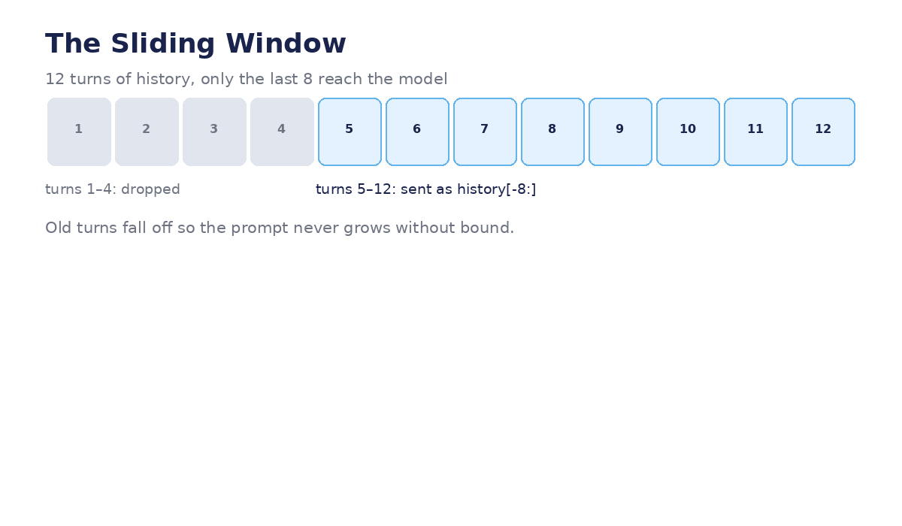

# Module 04 — Context and Short-Term Memory

*How the agent remembers the conversation: message lists, sliding windows, and
prompts — with the demo's `_llm()` helper rebuilt and explained.*



---

## Lecture 4.1 — Why LLMs forget (demonstration)

Every LLM call is stateless. "Memory" is a prompting trick: you re-send history
with each call. Prove it to yourself:

```python
# Call 1
r1 = LLM.invoke("My name is Ada. Remember it.")
# Call 2 — fresh, no history
r2 = LLM.invoke("What's my name?")
print(r2.content)   # "I don't know."  ← genuine amnesia

# Call 3 — with history re-attached
r3 = LLM.invoke([
    {"role": "user", "content": "My name is Ada. Remember it."},
    {"role": "assistant", "content": "Got it, Ada!"},
    {"role": "user", "content": "What's my name?"},
])
print(r3.content)   # "Your name is Ada."  ← memory restored
```

The model didn't learn anything between calls 2 and 3 — *you* supplied the past.
Every memory system in this course is machinery for deciding **what past to
supply**.

**Lab:** Repeat the experiment with 10 exchanges between the name and the
question. At what distance does the model start failing even *with* history?
(That's attention decay — the reason for Lecture 4.3.)

## Lecture 4.2 — The message list, field by field

```python
messages = [
    {"role": "system",    "content": "You are the OneClick ingestion assistant. ..."},
    {"role": "user",      "content": "Ingest SAP ECC sales data"},
    {"role": "assistant", "content": "Which SAP system — ECC or S/4HANA?"},
    {"role": "user",      "content": "ECC"},
]
```

| Role | Purpose | Written by |
|---|---|---|
| `system` | Behavior instructions, output contracts | you, once |
| `user` | What the human said | the human (or your code, replaying it) |
| `assistant` | What the model said | the model (stored by your code) |

**In the demo:** `self.history` is a list of `(role, content)` tuples — the same
idea. LangGraph's `add_messages` manages the list as a reducer and also accepts
these dicts directly.

**Common mistake:** stuffing instructions into a `user` message ("Remember, you
are…"). System prompts carry more weight and don't pollute the conversation the
model is trying to continue.

**Lab:** Convert the demo's tuple-history into message dicts. Then deliberately
mislabel one assistant message as `user` and observe how the model's next reply
changes — roles matter more than beginners expect.

## Lecture 4.3 — The sliding window (full implementation)

```python
WINDOW = 8

def build_prompt(system_prompt: str, history: list, new_prompt: str) -> list:
    """Fresh message list for every LLM call: system + last 8 turns + new prompt."""
    msgs = [{"role": "system", "content": system_prompt}]
    for role, content in history[-WINDOW:]:      # ← the window
        msgs.append({"role": "user" if role == "user" else "assistant",
                     "content": content})
    msgs.append({"role": "user", "content": new_prompt})
    return msgs

def llm(prompt: str, history: list) -> str:
    return LLM.invoke(build_prompt(SYSTEM, history, prompt)).content
```

This is the demo's `_llm()` helper, cleaned up. The `[-WINDOW:]` slice is the
entire memory policy: **recent turns are context, old turns are gone.**

The trade-off, made concrete:

| Window | Cost | Risk |
|---|---|---|
| 2 | cheap | forgets the original goal by turn 4 |
| 8 (demo) | moderate | fine for a 12-phase wizard |
| 50 | expensive | drowns the model; old corrections resurface as confusion |

**Example — the failure mode:** with `WINDOW = 2`, the user says "actually make
it Salesforce not SAP" at turn 3, and by turn 6 the agent asks "which SAP
system?" again — the correction fell out of the window. The fix isn't always a
bigger window; it's promoting corrections into **state** (`intent` dict), which
— unlike history — never scrolls away. That's the deep lesson: *history is for
context, state is for facts.*

**Lab:** Run a 6-turn scripted conversation through `build_prompt` with
`WINDOW = 2` and `WINDOW = 8`. Diff the prompts sent at turn 6. Which facts
survive in each?

## Lecture 4.4 — System prompts as job descriptions (with examples)

Three real prompts from the demo, annotated:

**1. The extractor (strict contract):**

```
Extract intent as JSON only:
{"source_system": "name or null",
 "source_type": "database|saas|file|streaming|unknown",
 "tables": [], "context": "brief"}
Message: {msg}
```

Techniques: enumerated vocabulary (`database|saas|file|streaming|unknown`),
explicit null/unknown escape hatches, no prose allowed. Temperature 0.1,
because this output feeds `json.loads()`.

**2. The classifier (role + contract):**

```
You are a data governance classifier. For each table, return
{"table": ..., "classification": "PHI|PII|Financial|Public|Unknown",
 "reason": "one sentence"}.
When unsure, choose the MORE sensitive classification.
```

The last line is doing heavy lifting: it encodes a *policy bias* (err toward
caution) directly in the prompt. Governance as English.

**3. The ReAct prompt (rules + example):**

```
Answer questions using tools. Format:
Thought: <reasoning>
Action: <tool name>, Input: <input>
Pause
(You receive: Observation: <result>)
...repeat...
Answer: <final>

Example:
Question: How much does a toy poodle weigh?
Thought: I need a weight lookup.
Action: average_dog_weight, Input: toy poodle
Pause
Observation: A toy poodle weighs ~6.5kg.
Thought: I have the answer.
Answer: A toy poodle weighs about 6.5kg.
```

The worked example is the highest-leverage part — the model imitates the trace
shape. When your agent's format drifts, fix the example first.

**Lab:** Take prompt #1 and delete the allowed-values list. Feed it "get the
thing from the place" five times at temperature 0.7. Count how many distinct
`source_type` spellings you get — that's why contracts exist.

## Lecture 4.5 — Short-term memory in LangGraph (the handoff)

Everything in this module is **short-term**: it lives for the run and dies with
it. In LangGraph:

```python
class AgentState(TypedDict):
    messages: Annotated[list, add_messages]  # ← this module, as a reducer
```

`add_messages` appends each turn; your `WINDOW` logic decides what gets *sent*
(keep the full history in state for the audit trail, send only the window to
the model — best of both).

When memory must survive the run — user preferences, "we always mask PII",
facts from last week — that's **long-term memory**. Next module.

**Example — the split in practice:**

```python
# sent to the model (short-term, windowed):
prompt_msgs = build_prompt(SYSTEM, state["messages"], new_question)

# remembered across sessions (long-term, Module 05):
#   thread "alice": prefers parquet, masks PII by default
```

**Lab:** Draw the line for OneClick: label each `OneClickState` field
short-term (dies with the run) or long-term (should survive). If you marked
`config_answers` long-term, what breaks when the user starts a *second*
ingestion next week?

---
← [← Module 03](module-03-state-management.md) · [Next: Module 05 →](module-05-long-term-memory-and-persistence.md)
