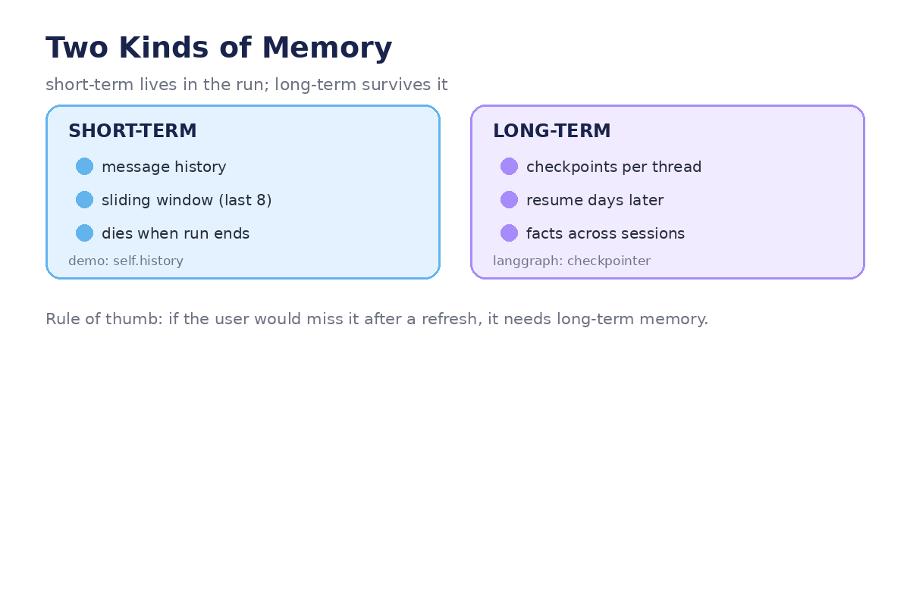
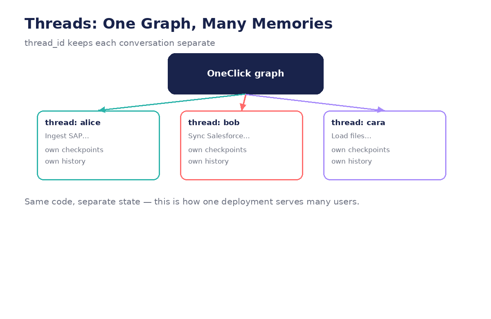

# Module 05 — Long-Term Memory and Persistence

*How work survives a crash, a closed laptop, or next week: checkpoints, threads,
and resume — with runnable code.*




---

## Lecture 5.1 — The checkpointer (one line, big consequences)

```python
from langgraph.checkpoint.memory import MemorySaver

graph = graph.compile(checkpointer=MemorySaver())
```

Every state transition is now saved automatically — after *each node*, not just
at the end. Compare the demo:

```python
# demo: a single snapshot at the very end
self._write_config_file()   # /tmp/oneclick_runs/<run_id>/config.json
```

A snapshot tells you what happened. A checkpointer lets you **continue** — the
difference between an audit log and a save game.

**Example — inspecting what got saved:**

```python
agent = graph.compile(checkpointer=MemorySaver())
config = {"configurable": {"thread_id": "demo-1"}}

for step in agent.stream({"messages": []}, config):
    pass   # run to completion

snapshot = agent.get_state(config)
print(snapshot.values.keys())       # all state fields, final values
print(snapshot.next)                # which node would run next (empty = done)
print(snapshot.config)              # the checkpoint id
```

`get_state()` is your x-ray: current values, what runs next, and the checkpoint
history (`agent.get_state_history(config)` lists every step).

**Lab:** Stream a 4-node run, then print `len(list(agent.get_state_history(config)))`.
You should see one checkpoint per node plus the initial one.

## Lecture 5.2 — Threads: one memory per conversation (worked example)

```python
alice = {"configurable": {"thread_id": "alice"}}
bob   = {"configurable": {"thread_id": "bob"}}

agent.invoke({"messages": ["Ingest SAP sales data"]}, alice)
agent.invoke({"messages": ["Sync Salesforce contacts"]}, bob)
agent.invoke({"messages": ["my name is Alice"]}, alice)

print(agent.get_state(alice).values["messages"][-1])  # "my name is Alice"
print(agent.get_state(bob).values["messages"][-1])    # "Sync Salesforce contacts"
```

Same graph object, same code — two completely separate memories. The
`thread_id` is the conversation's identity, and the checkpointer namespaces
everything under it. This is how one deployment serves many users without
mixing up their pipelines.

**In the demo:** there are no threads — one `OneClickAgent` instance *is* one
conversation. Two users means two processes. Threads are the production answer.

**Example — the bug threads prevent:** without namespacing, Alice's
`selected_tables = ["VBAK"]` and Bob's `selected_tables = ["Contact"]` would
collide in shared state. With threads, they can't even see each other.

**Lab:** Interleave three invokes across two threads. After each, assert
`get_state` for the *other* thread is unchanged. Then try reusing a thread_id
for a *new* conversation — what happens? (That's why UIs generate fresh IDs.)

## Lecture 5.3 — Resume after interruption (the save-game demo)

```python
# --- script 1: start, get interrupted ---
config = {"configurable": {"thread_id": "wizard-7"}}
for i, step in enumerate(agent.stream({"messages": ["Ingest SAP data"]}, config)):
    if i == 2:
        print("💥 simulated crash after 3 nodes")
        break

# --- script 2: a new process, later ---
agent2 = graph.compile(checkpointer=MemorySaver())  # same checkpointer backend!
state = agent2.get_state(config)
print("resuming with:", list(state.values.keys()))
print("next node:", state.next)

agent2.invoke(None, config)   # None = no new input, just continue from checkpoint
```

With a persistent backend (Postgres, Redis — `MemorySaver` is only for dev),
script 2 can run *days* later on a *different machine*. The demo's `back` and
`restart` commands are manual, in-memory versions of this; the checkpointer
makes "continue where I left off" survive anything short of data loss.

**Lab:** Actually run the two-script version (use a file-backed checkpointer or
just two compiles sharing one `MemorySaver` instance). Verify the resumed run
doesn't re-execute the first 3 nodes — check via `stream()` output.

## Lecture 5.4 — What deserves to persist? (decision framework)

Persisting everything is wasteful (large payloads × every step); persisting too
little breaks resume. The framework:

| Persist | Don't persist | Why |
|---|---|---|
| user answers, selections, approvals | LLM scratch text | decisions are irreplaceable; scratch is recomputable |
| `intent`, `pipeline_name` | full `discovered_tables` payloads | small facts vs big listings (store a query, not the dump) |
| checkpoint *pointers* | transient counters | `config_idx` matters; loop scratch doesn't |

**Worked example — the OneClick audit:**

```python
PERSIST = {"intent", "connection", "selected_tables", "column_mappings",
           "metadata_result", "policy_overrides", "config_answers",
           "pipeline_name", "intent_confirmed"}
EPHEMERAL = {"messages",        # rebuildable from checkpoint history
             "discovered_tables",  # re-queryable from INFORMATION_SCHEMA
             "config_idx",       # cursor, meaningless alone
             "run_spec"}         # derived snapshot, rebuilt at export
```

Note `discovered_tables`: re-running the INFORMATION_SCHEMA query is cheaper
than storing 10,000 table names at every checkpoint — and fresher, too.

**Lab:** Apply the framework to your own project (or the capstone). For each
field you marked ephemeral, write the one line of code that rebuilds it.

## Lecture 5.5 — From /tmp JSON to real persistence (production sketch)

The demo's export is for humans; the checkpointer is for the machine. Production
needs both, plus a real backend:

```python
# dev (this course):
from langgraph.checkpoint.memory import MemorySaver
checkpointer = MemorySaver()

# production (sketch):
# from langgraph.checkpoint.postgres import PostgresSaver
# checkpointer = PostgresSaver.from_conn_string("postgresql://...")
# checkpointer.setup()   # creates the tables

graph = graph.compile(checkpointer=checkpointer)

# humans still get their artifact:
def export_run(state, run_id):
    spec = {
        "pipeline_name": state["pipeline_name"],
        "intent": state["intent"],
        "tables": state["selected_tables"],
        "mappings": state["column_mappings"],
        "policies": state["policy_overrides"],
        "checkpoints": len(list(graph.get_state_history(
            {"configurable": {"thread_id": run_id}}))),
    }
    return spec   # → written as JSON, the demo's _write_config_file, upgraded
```

**Choosing a backend:** Postgres when you need concurrent users + crash recovery
+ audit queries ("show me every run that touched PHI tables"); Redis when you
need speed and can tolerate loss; `MemorySaver` never leaves the laptop.

**Lab:** Write the audit query for your backend of choice: "list all threads
where `policy_overrides` contains `audit_logging`, with their pipeline names."
If you can't write it, your persistence design is missing something.

---
← [← Module 04](module-04-context-and-short-term-memory.md) · [Next: Module 06 →](module-06-human-in-the-loop.md)
