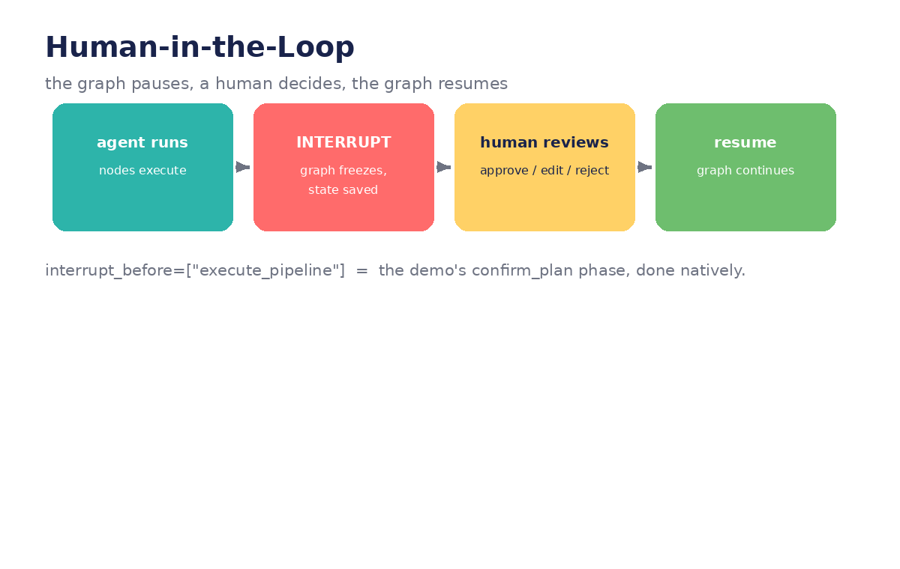
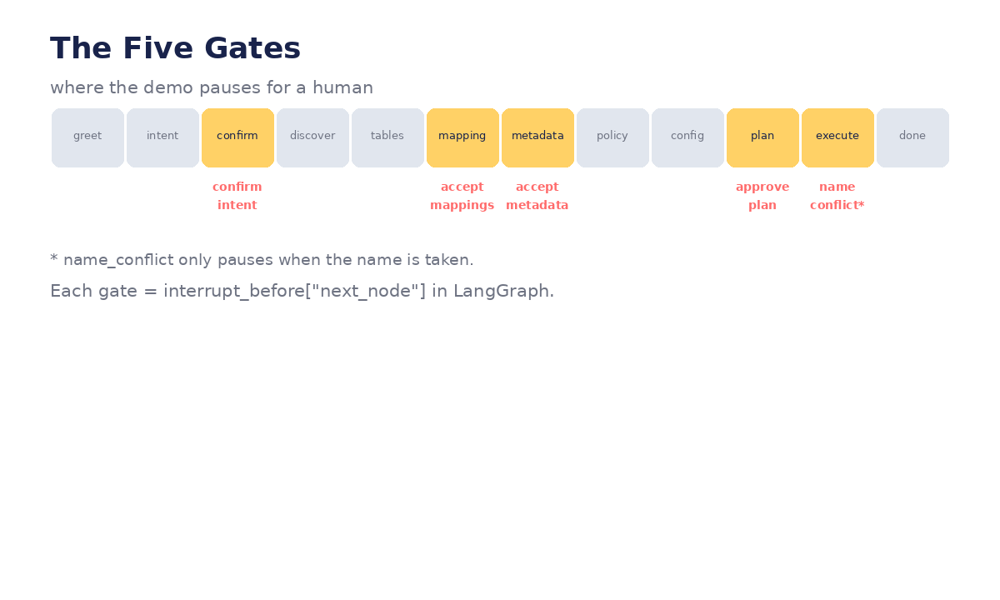

# Module 06 — Human-in-the-Loop (HITL)

*Where humans approve, edit, or stop the agent: interrupts, review gates, and
editable state — with the demo's five gates rebuilt natively.*




---

## Lecture 6.1 — Why agents must pause (the five gates)

The demo pauses **five times** across its 12 phases. Each gate and what it guards:

```python
GATES = {
    "confirm_intent":   "wrong intent → wrong connections → wrong everything",
    "mapping review":   "wrong column map → silently wrong data",
    "metadata review":  "wrong classification → wrong governance",
    "confirm_plan":     "last chance before creating real infrastructure",
    "name_conflict":    "conditional — only fires when the name is taken",
}
```

**The design rule, with teeth:** interrupt before anything *irreversible*
(creating pipelines, writing data, spending money) and after anything *expensive
to redo* (a 20-minute discovery scan). Every gate should be able to answer:
"What disaster does this prevent, specifically?"

**Example — the disaster each gate prevents:**

> *No confirm_intent:* user says "get sales data," agent assumes SAP ECC, but
> they meant the Salesforce "Sales_Data__c" object. The pipeline builds against
> the wrong system. Nobody notices until the dashboard is empty.
>
> *No mapping review:* `AMOUNT` maps to `amount_usd` instead of `amount_eur`.
> No error. Every downstream report is wrong by the exchange rate, forever.

**Lab:** For your own agent idea (or the capstone), list every irreversible
action. Each one needs a gate — write the one-sentence disaster it prevents.

## Lecture 6.2 — interrupt_before / interrupt_after (runnable)

```python
from langgraph.checkpoint.memory import MemorySaver

graph = graph.compile(
    checkpointer=MemorySaver(),          # interrupts REQUIRE a checkpointer
    interrupt_before=["execute_pipeline"],
)

config = {"configurable": {"thread_id": "run-1"}}
agent.invoke({"messages": ["Ingest SAP sales data"]}, config)
# ... graph runs through mapping, metadata, config, then STOPS.
# invoke() returns; the process is free. The state is saved.

state = agent.get_state(config)
print(state.next)   # ('execute_pipeline',) ← waiting here
```

Resume after the human approves:

```python
human_says = input("Create this pipeline? (yes/no): ")
if human_says == "yes":
    agent.invoke(None, config)   # None = no new input, just continue
else:
    print("Run cancelled. State preserved — resume any time.")
```

`interrupt_after=["confirm_plan"]` is equivalent here — pause *after* the plan
is shown vs *before* execution begins. Pick the one that reads better in your
graph diagram.

**In the demo:** the `confirm_plan` phase *is* this — a node whose only job is
to wait. LangGraph deletes the need for the phase entirely.

**Lab:** Add `interrupt_before=["act"]` to your Module 02 ReAct graph. At the
pause, print the parsed tool name and input, ask for approval, then resume or
abort. Time how long the pause lasts — interrupts don't consume resources while
waiting.

## Lecture 6.3 — Editing state at the pause (the superpower)

Approval is the boring use. The powerful use is **correction**: the human fixes
the state, then resumes:

```python
# paused before execute_pipeline; human spots the wrong table:
state = agent.get_state(config)
print(state.values["selected_tables"])   # ['VBAK', 'WRONG_TABLE']

agent.update_state(config, {"selected_tables": ["VBAK", "VBAP"]})
# optionally re-run the downstream node that derived from the old value:
# agent.update_state(config, {"column_mappings": []}, as_node="mapping")

agent.invoke(None, config)   # continues with corrected facts
```

`update_state` writes new values into the checkpoint; `as_node="mapping"` rewinds
the "next node" pointer so the mapping node re-runs with the fix. This is the
demo's "correct me" path from `confirm_intent`, generalized to *any* field at
*any* pause.

**Example — the support ticket it replaces:**

> *Before:* "The agent picked the wrong table and built the pipeline. File a
> ticket to delete it."
>
> *After:* the reviewer sees `WRONG_TABLE` in the paused state, swaps it for
> `VBAP`, resumes. Total delay: 30 seconds. No ticket.

**Lab:** Pause your graph before `act`, use `update_state` to change the tool
input (e.g. poodle → bulldog), resume, and verify the observation reflects the
edit. Then try `as_node` to re-run an earlier node — what changes in the
checkpoint history?

## Lecture 6.4 — Approval UX patterns (with code sketches)

**Pattern 1 — Yes/No gate** (the demo's approach):

```python
if input(f"Create pipeline '{name}'? (yes/no): ").lower() != "yes":
    raise Cancelled("user declined")
```

**Pattern 2 — Edit-then-approve** (show, tweak, confirm):

```python
plan = state.values["run_spec"]
print(json.dumps(plan, indent=2))
edits = input("Edit as JSON (or Enter to accept): ")
if edits.strip():
    agent.update_state(config, {"run_spec": json.loads(edits)})
agent.invoke(None, config)
```

**Pattern 3 — Auto-approve with exceptions** (pause only on anomaly):

```python
def route_after_plan(state):
    if state["policy_overrides"]:          # governance involved → human must look
        return "human_review"
    if state["estimated_rows"] > 1_000_000: # big blast radius → human must look
        return "human_review"
    return "execute_pipeline"              # boring case → proceed alone
```

Note the demo's inverse: policy overrides apply *automatically* with no human
override allowed — governance isn't subject to approval, it's subject to
*enforcement*. Both directions exist in real systems.

**Lab:** Implement Pattern 3's router with two anomaly conditions of your own.
Write a test for each: one state that auto-approves, one that routes to review.

## Lecture 6.5 — The config wizard as HITL (full implementation)

The demo's `configure` phase is a human-in-the-loop interaction stretched over
many turns. Here's the graph version:

```python
QUESTIONS = [
    {"key": "sync_mode",   "ask": "Sync mode?", "options": ["full", "incremental"], "default": "incremental"},
    {"key": "schedule",    "ask": "Schedule?",  "options": ["hourly", "daily"],      "default": "daily"},
    {"key": "destination", "ask": "Write to catalog?", "options": None,              "default": "adh_bronze"},
]

def ask_config(state: OneClickState):
    """One node, driven by config_idx. 'back' rewinds the index."""
    idx = state["config_idx"]
    q = QUESTIONS[idx]
    if q["options"]:
        print(f"{q['ask']} {list(enumerate(q['options'], 1))} [default: {q['default']}]")
    answer = input("> ").strip() or q["default"]
    if answer == "back":
        return {"config_idx": max(0, idx - 1)}   # rewind; answers dict keeps history
    if q["options"] and answer.isdigit():
        answer = q["options"][int(answer) - 1]
    print(f"  Set {q['key']} = {answer}")        # echo — never silent (demo's rule)
    return {"config_answers": {q["key"]: answer}, "config_idx": idx + 1}

def route_config(state: OneClickState):
    if state["config_idx"] >= len(QUESTIONS):
        return "confirm_plan"
    return "ask_config"   # loop until all questions answered

graph.add_node("ask_config", ask_config)
graph.add_conditional_edges("ask_config", route_config)
```

Because answers merge into `config_answers` (Module 03's dict reducer), going
`back` just decrements the index and re-asks — previous answers are still there
to be overwritten. The echo (`Set X = Y`) is a UX rule the demo got right:
silent wizards make users distrust the agent.

**Lab:** Run the wizard, answer Q1, type `back` at Q2, change Q1's answer, and
verify `config_answers` holds the *new* Q1 value. Then add a 4th question of
your own with no options (free text) and a default.

---
← [← Module 05](module-05-long-term-memory-and-persistence.md) · [Next: Module 07 →](module-07-advanced-debugging.md)
