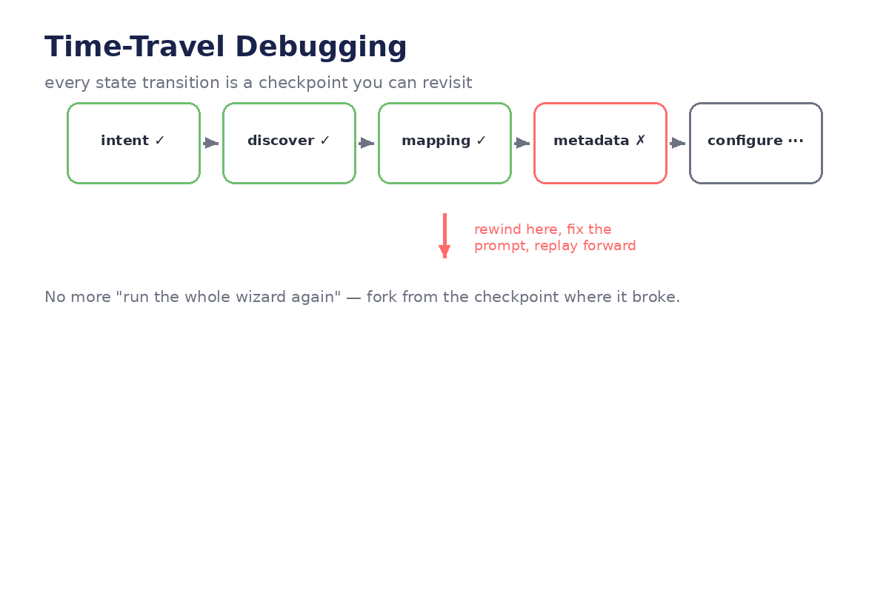
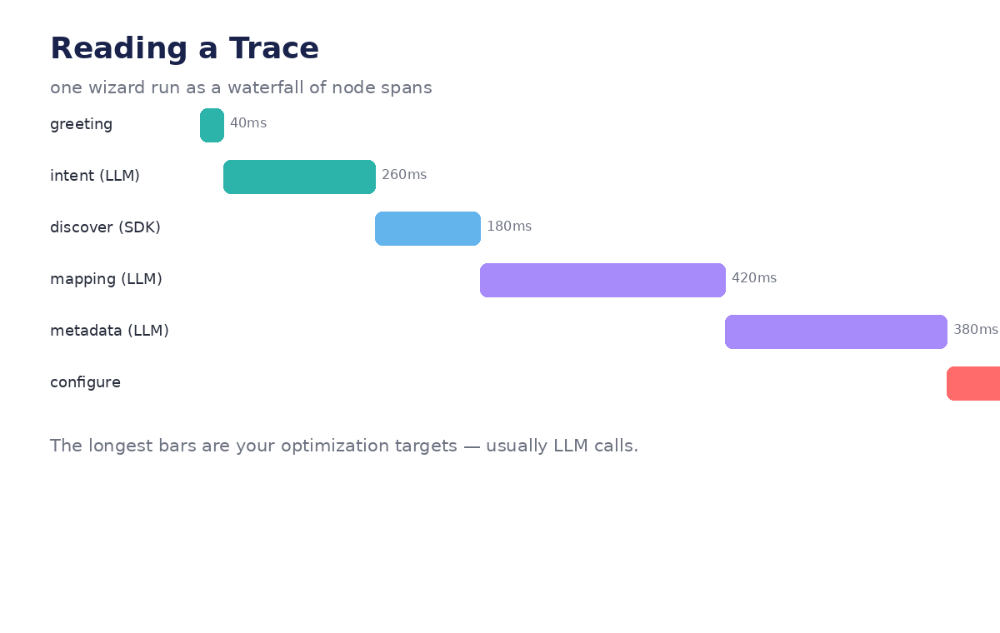

# Module 07 — Advanced Debugging

*How to find out why the agent did that: streaming, tracing, time-travel, unit
tests, and the honesty rule — all with code.*




---

## Lecture 7.1 — Stream everything (debug harness)

Build yourself a standard debug harness and use it for every run:

```python
def debug_run(agent, inputs, config):
    """Stream a run, printing each node's updates with timing."""
    import time
    for step in agent.stream(inputs, config, stream_mode="updates"):
        node = list(step.keys())[0]
        t0 = time.time()
        updates = step[node]
        print(f"▶ {node} ({time.time()-t0:.2f}s)")
        for k, v in updates.items():
            preview = str(v)[:120]
            print(f"    {k} = {preview}")

config = {"configurable": {"thread_id": "debug-1"}}
debug_run(agent, {"messages": ["Ingest SAP sales data"]}, config)
```

Sample output:

```
▶ greeting (0.01s)
    messages = ['👋 Hi! ...']
▶ extract_intent (2.31s)
    intent = {'source_system': 'SAP', 'source_type': 'database', ...}
▶ discover (4.12s)
    discovered_tables = ['VBAK', 'VBAP', 'KNA1', ...]
```

The first question in any debugging session — *"which node produced the bad
value?"* — is answered before you even start thinking. The demo's
`agent_banner()` calls are this harness, hand-rolled.

**Lab:** Run `debug_run` on a working graph, then inject a bug (wrong key in one
node's return). Find it using only the harness output. Time yourself.

## Lecture 7.2 — Trace with LangSmith (reading the waterfall)

Enable tracing and read one full wizard run as a waterfall (see diagram above):

```python
import os
os.environ["LANGCHAIN_TRACING_V2"] = "true"
os.environ["LANGCHAIN_PROJECT"] = "oneclick-debug"
# LANGCHAIN_API_KEY in env
```

What to look for in the trace:

1. **The longest bars** — usually LLM calls (`extract_intent`, `mapping`,
   `metadata`). These are your cost and latency center.
2. **Token counts per node** — is `metadata` sending the entire table list
   every call? (Module 04's window applies here too.)
3. **The exact prompt** — click the span, read what the model *actually* saw.
   Half of "the model is dumb" bugs are "the prompt was wrong" bugs.

**Example — a real find:** the trace shows `mapping` spending 8k tokens because
it receives all 200 discovered tables instead of the 3 selected ones. Fix: the
node should read `selected_tables`, not `discovered_tables` (Module 03's
minimalism rule — now with a dollar amount attached).

**Lab:** Trace one run. Find the most expensive node. Propose the smallest code
change that cuts its tokens by half. (Hint: it's almost always "send less in.")

## Lecture 7.3 — Time-travel: rewind and replay (full workflow)

The scenario: the mapping prompt is bad, and you don't want to re-run the whole
wizard to test the fix.

```python
config = {"configurable": {"thread_id": "run-9"}}

# 1. find the checkpoint right BEFORE the bad node ran
history = list(agent.get_state_history(config))
for snap in history:
    print(snap.config["configurable"]["checkpoint_id"], "→ next:", snap.next)
# pick the checkpoint whose next == ('mapping',)

# 2. rewind to it (checkout rewinds the pointer; state is as it was)
bad_checkpoint = ...  # the one before mapping
agent.update_state(bad_checkpoint, {})   # no-op write, just to select it
# simpler: get_state with that checkpoint's config, then:

# 3. fix the cause — edit the prompt (in code), and/or correct the inputs:
agent.update_state(config, {"selected_tables": ["VBAK", "VBAP"]})

# 4. replay forward from the mapping node:
agent.update_state(config, {}, as_node="mapping")
final = agent.invoke(None, config)
```

No re-running discovery. No re-answering 12 phases. The checkpoint history is a
save-game list; `as_node` picks where to resume from.

**In the demo:** impossible — there's one JSON snapshot at the end and no
per-step history. This is the single biggest debugging upgrade in the rebuild.

**Lab:** Deliberately break a prompt, run to the failure, then time-travel per
the workflow above. Measure: full re-run time vs rewind-and-replay time.

## Lecture 7.4 — Test nodes in isolation (the cheap superpower)

Nodes are functions; functions get unit tests. Three test patterns from the demo:

**Pattern A — pure logic (the policy engine):**

```python
def test_phi_policy():
    state = {"metadata_result": [{"table": "patients", "classification": "PHI"}]}
    out = apply_policy(state)
    assert "audit_logging" in out["policy_overrides"]
    assert "no_data_preview" in out["policy_overrides"]
```

**Pattern B — invalidation rules:**

```python
def test_back_to_discover_clears_derived_state():
    state = {"intent": {"source_system": "SAP"}, "connection": {"name": "sap_ecc"},
             "selected_tables": ["VBAK"], "column_mappings": [{"a": 1}],
             "metadata_result": [{"t": 1}], "config_answers": {"k": "v"}}
    out = go_back(state, "discover")
    assert out["selected_tables"] == []
    assert out["column_mappings"] == []
    assert out["metadata_result"] == []
    assert out["config_answers"] == []
```

**Pattern C — routers (the most valuable tests you'll write):**

```python
def test_router_sends_unconfirmed_back_to_intent():
    assert route_after_confirm({"intent_confirmed": False}) == "confirm_intent"

def test_router_bounds_iterations():
    assert route_after_think({"messages": ["Action: x"], "iterations": 99}) == "give_up"
```

Router tests are cheap and catch the bugs that strand users in loops. Write them
for every conditional edge in your capstone.

**Lab:** Pick any three nodes/routers from your Module 08 graph and write tests
in all three patterns. Aim: run the suite in under a second, no LLM, no network.

## Lecture 7.5 — The honesty rule: real data only (debugging philosophy)

The demo's hardest-won lesson, preserved verbatim in a code comment:

```python
# _discover_tables removed — we only use real INFORMATION_SCHEMA data,
# never LLM-generated table names
```

The failure mode it prevents is uniquely nasty: the LLM invents `SALES_FACT`
— a plausible, confident, *nonexistent* table. Nothing errors. The pipeline
builds against a ghost. You discover it in production.

**The audit — label every node output:**

```python
# For each node, mark every output field:
#   WORLD    ← from SDK / source system (w.connections.list, INFORMATION_SCHEMA)
#   MODEL    ← from the LLM (intent, mappings, classifications)
#   DERIVED  ← computed from other fields (policy_overrides, run_spec)

NODE_PROVENANCE = {
    "discover":       {"discovered_tables": "WORLD"},
    "extract_intent": {"intent": "MODEL"},
    "mapping":        {"column_mappings": "MODEL"},
    "metadata":       {"metadata_result": "MODEL"},
    "apply_policy":   {"policy_overrides": "DERIVED"},
}
```

**The rule:** every `MODEL`-labeled fact needs a test or a human gate before it
touches the world. `intent` → confirm gate. `column_mappings` → review gate.
`metadata_result` → review gate + policy derivation. `WORLD` facts need no gate
(they're already true); `DERIVED` facts need tests (Lecture 7.4, Pattern A).

**Lab:** Do the provenance audit on your full capstone graph. For each `MODEL`
field, write down its gate or test. Any field with neither is a production
incident waiting to happen — fix it now.

---
← [← Module 06](module-06-human-in-the-loop.md) · [Next: Module 08 →](module-08-conclusion-and-challenges.md)
