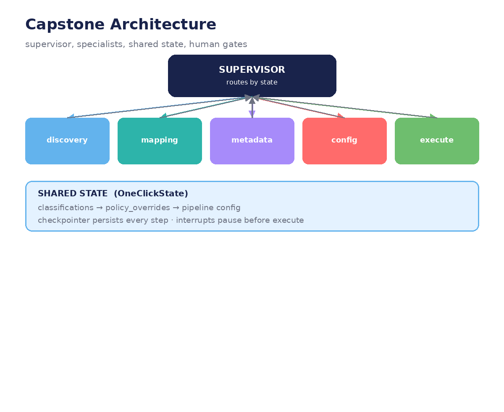

# Module 08 — Conclusion and Challenges

*Capstone: assemble the full OneClick agent as a production LangGraph application —
complete graph code, the supervisor upgrade, and challenges.*



---

## Lecture 8.1 — Assembling the graph (complete code)

Everything from Modules 01–07, wired together. Read it top to bottom — it's the
whole course in one listing:

```python
from typing import TypedDict, Annotated
from langgraph.graph import StateGraph, START, END, add_messages
from langgraph.checkpoint.memory import MemorySaver

# ---- state (Module 03) ----
class OneClickState(TypedDict):
    messages: Annotated[list, add_messages]
    intent: dict | None
    intent_confirmed: bool
    connection: dict | None
    discovered_tables: list
    selected_tables: list
    column_mappings: list
    metadata_result: list
    policy_overrides: list
    config_questions: list
    config_answers: Annotated[dict, "merge"]
    config_idx: int
    pipeline_name: str | None
    iterations: int

# ---- nodes (Modules 01, 04) ----
def greeting(state): ...
def extract_intent(state): ...     # Module 04's llm() + JSON contract
def confirm_intent(state): ...     # displays intent, reads yes/no/correct
def discover(state): ...           # WORLD data: w.connections.list + INFORMATION_SCHEMA
def select_tables(state): ...
def mapping(state): ...            # MODEL data: LLM proposes, human reviews
def metadata(state): ...           # MODEL data: classifications
def apply_policy(state): ...       # DERIVED: pure function (Module 03)
def ask_config(state): ...         # HITL wizard (Module 06)
def confirm_plan(state): ...       # shows plan, waits
def execute_pipeline(state): ...   # WORLD effect: w.pipelines.create()

# ---- routers (Module 02) ----
MAX_TURNS = 5
def route_confirm(state):
    if state["intent_confirmed"]: return "discover"
    if state["iterations"] >= MAX_TURNS: return "give_up"
    return "extract_intent"

def route_config(state):
    return "confirm_plan" if state["config_idx"] >= len(state["config_questions"]) else "ask_config"

def route_back(state):             # 'back' handling (Module 03 invalidation)
    ...

# ---- assembly ----
graph = StateGraph(OneClickState)
for name, fn in [("greeting", greeting), ("extract_intent", extract_intent),
                 ("confirm_intent", confirm_intent), ("discover", discover),
                 ("select_tables", select_tables), ("mapping", mapping),
                 ("metadata", metadata), ("apply_policy", apply_policy),
                 ("ask_config", ask_config), ("confirm_plan", confirm_plan),
                 ("execute_pipeline", execute_pipeline)]:
    graph.add_node(name, fn)

graph.add_edge(START, "greeting")
graph.add_edge("greeting", "extract_intent")
graph.add_edge("extract_intent", "confirm_intent")
graph.add_conditional_edges("confirm_intent", route_confirm)
graph.add_edge("discover", "select_tables")
graph.add_edge("select_tables", "mapping")
graph.add_edge("mapping", "metadata")
graph.add_edge("metadata", "apply_policy")
graph.add_edge("apply_policy", "ask_config")
graph.add_conditional_edges("ask_config", route_config)
graph.add_edge("confirm_plan", "execute_pipeline")
graph.add_edge("execute_pipeline", END)

agent = graph.compile(
    checkpointer=MemorySaver(),              # Module 05: persistence
    interrupt_before=["execute_pipeline"],   # Module 06: the final gate
)
```

Count what the framework gives you for free in those last four lines:
per-step persistence, multi-user threads, a native approval gate, and a graph
you can visualize, stream, trace, and time-travel through (Module 07).

**Lab:** Fill in the `...` node bodies from your earlier module labs. Run the
full graph with stubbed LLM/SDK calls first — get the *shape* right before the
*intelligence*.

## Lecture 8.2 — The supervisor upgrade (specialists, for real)

The demo *simulates* multi-agent with one class and the `AGENT_LABELS` registry.
The production version makes each label a real node with its own focused prompt:

```python
DISCOVERY_SYS = "You are the Source Discovery Agent. Match user intent to Unity Catalog connections. Reply JSON only."
MAPPING_SYS   = "You are the Mapping Service. Apply ADH naming rules. Reply JSON only."
METADATA_SYS  = "You are the Metadata Agent, a data governance classifier. Reply JSON only."

def discovery_agent(state: OneClickState):
    conns = w.connections.list()                       # WORLD
    pick = llm(DISCOVERY_SYS, state["messages"],
               f"intent={state['intent']} connections={[c.name for c in conns]}")
    return {"connection": json.loads(pick)}

def supervisor(state: OneClickState):
    """LLM coordinator: look at state, decide who works next."""
    order = ["discovery_agent", "mapping_agent", "metadata_agent", "config_agent"]
    done = state.get("completed", [])
    nxt = next((s for s in order if s not in done), "done")
    return {"next": nxt, "completed": done + [nxt]}

graph.add_node("supervisor", supervisor)
graph.add_node("discovery_agent", discovery_agent)
# ... other specialists ...
graph.add_conditional_edges("supervisor", lambda s: s["next"], {
    "discovery_agent": "discovery_agent",
    "mapping_agent": "mapping_agent",
    "metadata_agent": "metadata_agent",
    "config_agent": "config_agent",
    "done": END,
})
for w_ in ["discovery_agent", "mapping_agent", "metadata_agent", "config_agent"]:
    graph.add_edge(w_, "supervisor")   # report back after each task
```

Why specialists beat one giant prompt: each prompt is short, focused, and
testable in isolation (Module 07, Pattern A). They coordinate through shared
state — metadata writes classifications, policy reads them — never by calling
each other (Module 03).

**Lab:** Extract the metadata prompt into a standalone `metadata_agent` node.
Test it with 5 tables (2 PHI, 1 PII, 2 Public). Compare accuracy vs the
monolith prompt. Which fails more gracefully on an ambiguous table?

## Lecture 8.3 — Challenge: the policy engine (specification)

Extend `apply_policy` with three new rules, each as a conditional edge:

**Rule 1 — Financial data needs a human, always:**

```python
def route_after_metadata(state):
    classes = {m["classification"] for m in state["metadata_result"]}
    if "Financial" in classes:
        return "human_review_financial"   # new interrupt node
    return "apply_policy"
```

**Rule 2 — Public data skips review (fast path):**

```python
    if classes == {"Public"}:
        return "apply_policy"   # skip metadata review gate entirely
```

**Rule 3 — Unknown classification gets labeled by a human:**

```python
    if "Unknown" in classes:
        return "label_unknown"  # human picks the real classification, then re-run policy
```

**Acceptance criteria:** three unit tests (one per rule), each with a fake
`metadata_result`; plus one integration trace showing a mixed PHI+Public run
taking the review path while a pure-Public run skips it.

**Lab:** Implement all three. The tricky part is Rule 3's loop: after the human
labels, `metadata_result` must be updated and `apply_policy` re-run — draw the
edges before you code them.

## Lecture 8.4 — Challenge: the `back` command (specification)

Full backward navigation: from any node, the user types "back" to return to
the previous question *or* phase, with derived state invalidated per Module 03.

**Phase 1 — wizard-level back** (do this first):

```python
# inside ask_config: "back" → config_idx - 1, answers merge keeps the rest
```

**Phase 2 — phase-level back** (the hard one): maintain a `phase_stack` in
state; on "back", pop to the previous phase and clear derived fields via the
`INVALIDATION` map:

```python
def handle_back(state: OneClickState):
    stack = state["phase_stack"]          # e.g. [..., "discover", "select_tables"]
    target = stack[-2]                   # where we're going back to
    cleared = {f: [] for f in INVALIDATION[target]}
    return {**cleared, "phase_stack": stack[:-1], "next": target}
```

**Acceptance criteria:** scripted run — advance to `metadata`, type `back`
twice, change the connection, and assert `selected_tables`, `column_mappings`,
and `metadata_result` are all empty while `intent` survives.

**Lab:** The demo's `_go_back()` is ~60 lines. Yours should be shorter — the
`INVALIDATION` map does the heavy lifting. Compare line counts when done.

## Lecture 8.5 — Where to go next (and the final bug hunt)

**The final exercise** — a real bug from the demo, waiting for you:

```python
# in the name_conflict branch:
suggested = f"{base_name}_{run_id}"   # ← NameError: run_id is not defined here
```

`run_id` exists only inside `_execute_pipeline()`; the conflict branch runs
outside it. Find it, fix it (hint: the run id should come from state, not a
local), and add a regression test that triggers a name conflict. The course
ends where real engineering begins: reading code carefully.

**Beyond this course:**

- **Subgraphs** — give each specialist its *own* graph (own state, own
  interrupts), composed into the supervisor's graph. Teams can own subgraphs
  independently.
- **LangGraph Platform** — deploy the compiled graph as an API with built-in
  persistence, streaming, and a studio UI for the human gates.
- **Eval harnesses** — run the capstone against 20 scripted scenarios nightly;
  track mapping accuracy and gate-escape rate over time.

**Final lab:** Run your capstone end-to-end against a dev workspace. Trace it,
time-travel once deliberately, and write down the three things you'd fix first.
Then fix one.

---

### What you learned, in one page

1. **Graphs** make agent control flow visible — nodes, edges, compile, invoke, stream.
2. **Conditional edges** route by state; the ReAct loop is a cycle; bound every loop.
3. **State schemas + reducers** replace scattered attributes; invalidate derived state on rewind.
4. **Short-term memory** is re-sent history — window it; facts belong in state, not history.
5. **Checkpoints + threads** persist per step and per user; resume survives crashes.
6. **Interrupts** put humans before irreversible steps, with editable state at the pause.
7. **Streaming, tracing, time-travel, unit tests** make agents debuggable; label every output's provenance.
8. **The demo was a graph all along** — the framework makes it explicit, testable, and persistent.

---
← [← Module 07](module-07-advanced-debugging.md) · [Course home](README.md)

*Built from the OneClick Ingestion Agent notebook · September 2026*
